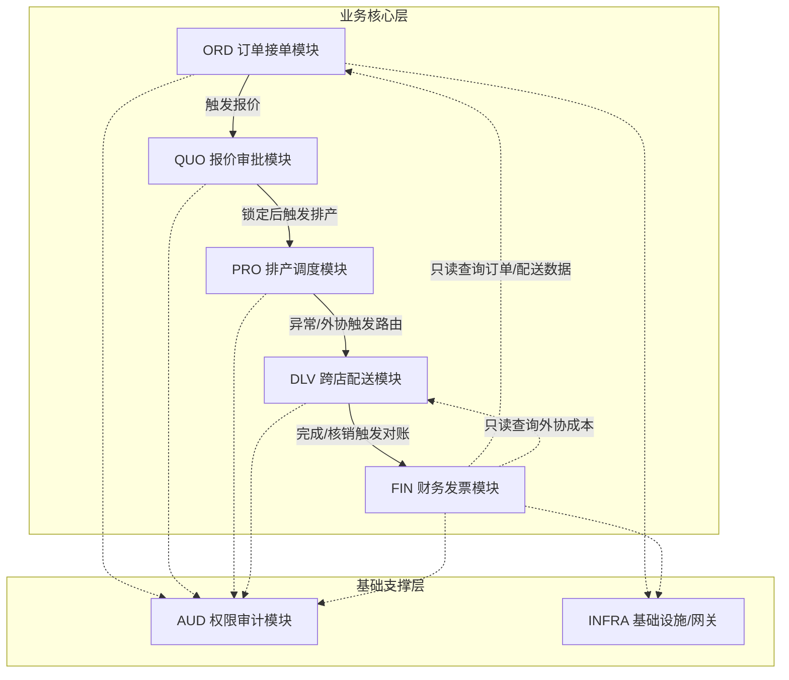

# DTS 依赖拓扑方案 (Dependency Topology Scheme)

## 1. 合法依赖白名单
模块间的依赖必须遵循业务流转方向与基础支撑原则，仅允许以下依赖关系：
1. **基础支撑依赖**：所有业务模块（ORD, QUO, PRO, DLV, FIN）均允许依赖 AUD（权限与审计）和 INFRA（基础设施与外部网关）。
2. **主业务流依赖**：
   - ORD -> QUO (订单提交后触发报价)
   - QUO -> PRO (报价锁定后触发排产)
   - PRO -> DLV (排产受阻或需外协时触发跨店路由)
   - DLV -> FIN (配送完成/外协产生后触发财务核销与对账)
3. **逆向查询依赖**：FIN 允许只读依赖 ORD, DLV 以获取对账所需的基础数据与外协成本。

## 2. 禁止依赖黑名单
为防止循环依赖与职责混乱，严禁以下依赖：
1. **逆向业务控制**：禁止 FIN -> PRO, FIN -> ORD（财务模块不得反向控制订单或生产状态）。
2. **跨级跳跃**：禁止 ORD -> PRO, ORD -> DLV（接单模块不得直接触发排产或配送，必须经过QUO报价锁定）。
3. **同级横向耦合**：禁止 QUO <-> PRO 双向依赖（报价与排产应通过事件或单向接口解耦，避免循环）。
4. **绕过接口直连**：禁止任何模块直接依赖另一模块的 Repository 或 DAO 层（必须通过 Application Service 接口）。

## 3. 依赖拓扑图 (Mermaid)

## 4. 拓扑合规性说明
- **单向主链路**：ORD → QUO → PRO → DLV → FIN 形成清晰的五步闭环主链路（依据 SRS 1.3 五步闭环定义），严禁逆向控制。
- **审计切面**：AUD 作为横切关注点，被所有业务模块依赖，确保 REQ-AUD-001 全量留痕的落地。
- **防腐与隔离**：INFRA 封装所有外部接口（支付、企微、税务、MQTT），业务模块不直接感知外部协议变化。
